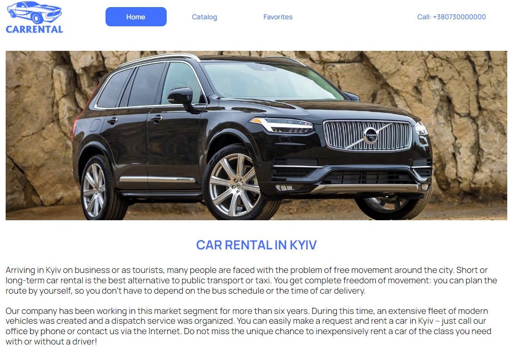
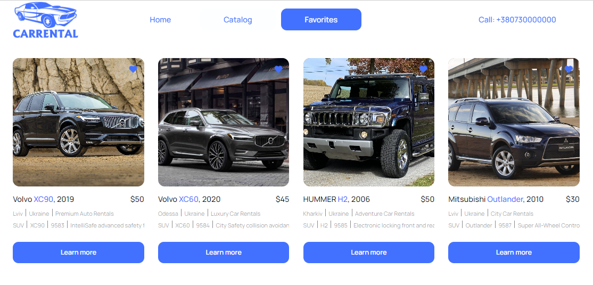

# CARRENTAL APPLICATION

# Особливості

## Домашня сторінка

Домашня сторінка містить короткий огляд послуг, які пропонує компанія з прокату автомобілів. Він служить відправною точкою для користувачів для навігації програмою.

## Сторінка каталогу

На сторінці каталогу ви можете знайти різноманітні автомобілі з різними характеристиками. Використовуйте фільтри, щоб звузити пошук за маркою автомобіля, погодинною ціною оренди та пробігом. Кнопка «Завантажити більше» дозволяє динамічно завантажувати додаткові списки.

Натисніть значок серця, щоб додати список до вибраного.

Натисніть Learn more, щоб переглянути детальну інформацію про певний автомобіль.

## Сторінка вибраного

Сторінка вибраного відображає списки, які ви додали до вибраного. Значок серця допомагає керувати вашими улюбленими оголошеннями, а кнопка Learn more надає додаткові відомості про кожен автомобіль.

## Звернення до орендної компанії

Щоб запитати про оренду автомобіля, натисніть кнопку Rental car в модальному вікні або натисніть Call:+380730000000 у Header. Ця дія з’єднає вас з прокатною компанією за телефоном +380730000000.

## Додаткова інформація

Програма використовує Redux для керування станом і Axios для надсилання запитів API.
Пагінація реалізована на сервері за допомогою MockAPI.
Службу інтерфейсу користувача для розробки надає MockAPI.
Проект розгорнуто на GitHub Pages.

Не соромтеся досліджувати, фільтрувати та насолоджуватися досвідом із програмою Rental Cars! Якщо у вас виникли проблеми або залишилися відгуки, повідомте нас. Приємної оренди!

## Технології, які використовувались

**Front-end** 
`React` `ReduxToolkit` `ReduxPersist` `Axios` `nanoid` `HTML/CSS` `react-loader-spinner` `react-toastify`

**Back-end** 
`UI-сервіс https://mockapi.io/`
